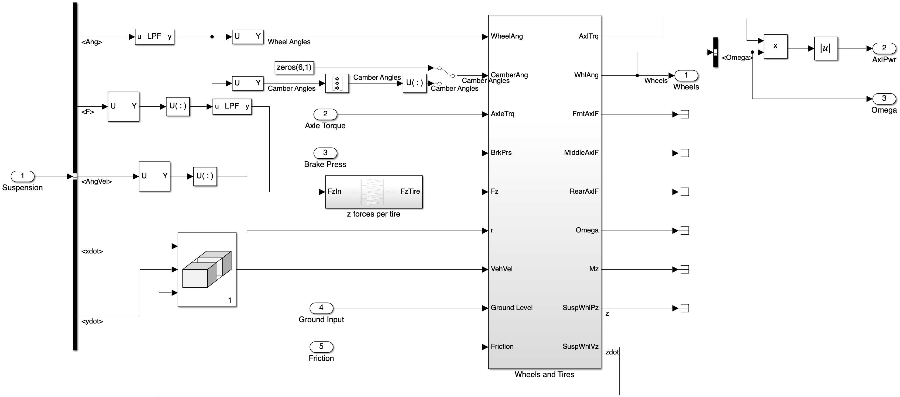
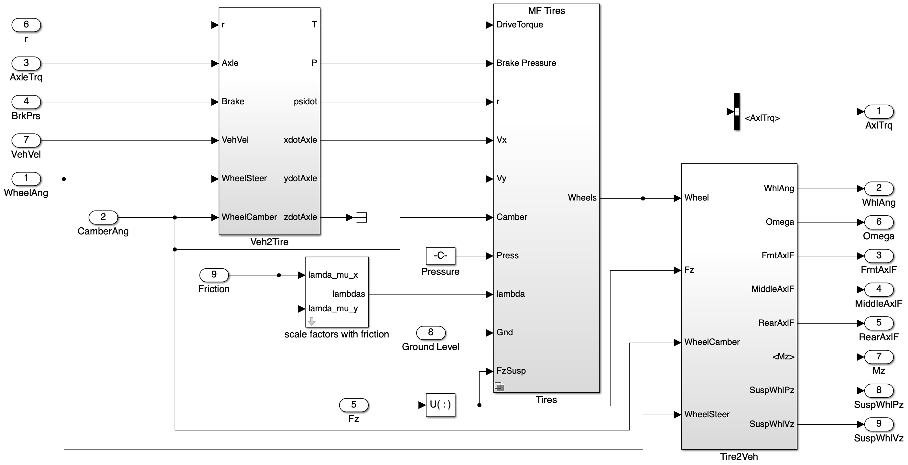
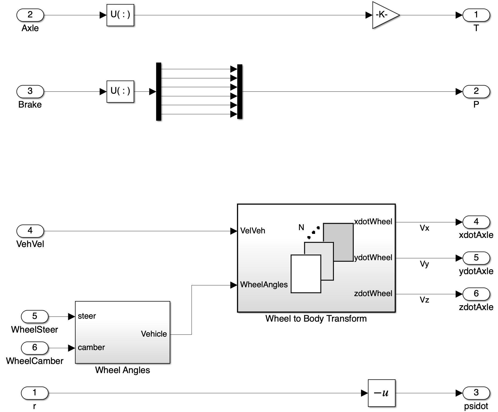
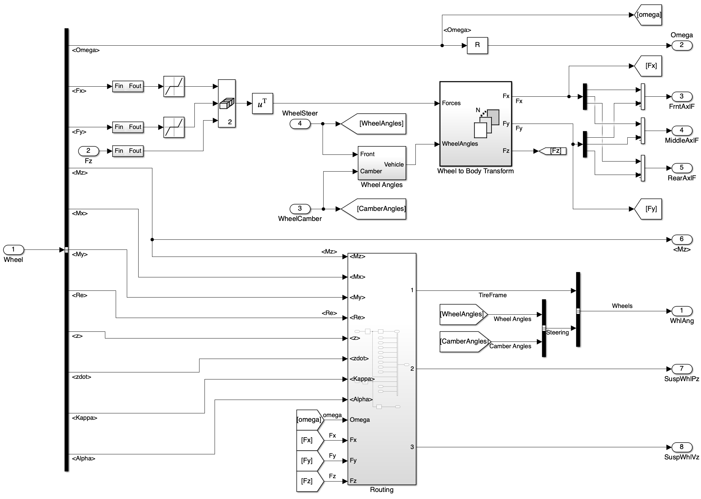
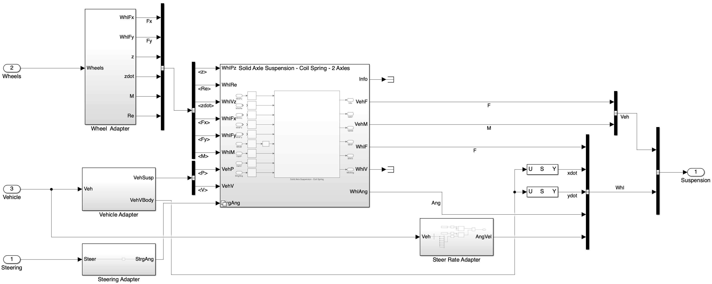

## Introduction and Objective {#introduction}

This document presents a basic truck dynamics model structure in Matlab Simulink, constructed by editing the existing Simulink model *6DOF truck-trailer dynamics* in the [Truck Platooning project](https://www.mathworks.com/help/driving/ug/truck-platooning-using-vehicle-to-vehicle-communication.html). The model includes components such as the accelerating/brake system, wheels and tires system, suspension system, and vehicle body system. The Simulink blocks are organized to represent the physical interactions between these components.

The purpose of this model is to simulate the dynamic behavior of a truck under various driving conditions, including acceleration, braking, and steering. The model can be used for testing control algorithms, analyzing vehicle performance, and evaluating different control algorithms such as PID controller and MPC controller. The modular design of the model allows for easy integration of additional features or subsystems in the future, such as advanced driver assistance systems (ADAS) or vehicle-to-vehicle communication.

## Model Assumption and Overall Structure {#overall-model-structure}

The truck dynamic model takes the desired *acceleration* and *steering angle* as inputs. By simulating the truck's response, the model outputs the truck's position, velocity and angular motion in both its inertial frame and global frame, as well as the forces and moments acting on the suspension and wheels. The output signals are packed into a bus for further processing and vehicle-to-vehicle communication. The model is structured to allow for modularity, enabling the addition of more complex components or subsystems in the future.

The dynamics of a real truck or most other ground vehicles contains three essential components, the **vehicle body**, the **suspension system**, and the **wheels and tires**. The vehicle body represents the main structure of the truck, while the suspension system models the interaction between the vehicle body and the wheels, including the forces and moments transmitted through the suspension components. The wheels and tires subsystem simulates the contact between the tires and the road surface, including tire forces and slip characteristics. The vehicle is driven by processing the control inputs through the **accelerating and brake system**. The interactions between these components are crucial for accurately simulating the truck's dynamics and response to control inputs.

## Model components {#model-components}

### Accelerating and brake system {#accelerating-and-brake-system}

#### Accelerating System {#accelerating-system}

{#fig-accelerating-system width=50%}

The accelerating system consists of a powertrain subsystem and a driveline subsystem. The powertrain subsystem simulates the accelerating behavior with consideration of realistic limit and output the requested total axle torque to the driveline subsystem. The driveline subsystem, choosing from Front Wheel Drive (FWD), Rear Wheel Drive (RWD), or All Wheel Drive (AWD) configurations, models the transfer of power from the engine to the wheels.

##### Powertrain Subsystem {#powertrain-subsystem}

{#fig-powertrain-subsystem width=100%}

The powertrain subsystem takes in the desired acceleration input, current axle power consumption and wheel angular velocity, and calculates the required total axle torque. Currently, with only one forward gear option, the powertrain subsystem is modeled as a simple proportional controller that calculates the required axle torque based on the desired acceleration and current wheel angular velocity, with consideration of the engine power limit and the axle torque limit. In the future, the proportional gain can be tuned to achieve the desired response by integrating more complex powertrain models, such as those that consider engine dynamics, transmission characteristics, and wheel rotational kinematics. 

##### Driveline Subsystem {#driveline-subsystem}

{#fig-driveline-subsystem width=50%}

The driveline subsystem models the power transfer from the engine to the wheels. Depending on the chosen configuration (FWD, RWD, AWD), torque distribution is managed accordingly. Based on the gear (currently only one forward gear and one backward gear), the driveline subsystem manage the sign of the torque at each driven axle. The driveline subsystem outputs the torque applied to each driven wheel, which is then used by the wheels and tires system to calculate the forces generated by the tires.

#### Brake System {#brake-system}

The brake system is a simple hydraulic system with fixed braking pressure, 200 kPa at front wheels and 1 MPa at rear wheels. When a negative acceleration is input, the brake system is activated and applies the corresponding braking forces to the wheels. In the future, the brake system can be improved by including the brake dynamics, wheel slip control, differential braking (DB), and anti-lock braking system (ABS) features.

### Wheels and Tires System {#wheels-and-tires-system}

{#fig-wheels-and-tires-system width=100%}

The wheels and tires system takes in the *axle torque* and *brake pressure* commands, as well as the *vehicle body states* from the suspension outputs. It outputs the angular velocity of the wheels, the current power consumption of the wheel, and other wheel state variables including the longitudinal and lateral forces, vertical position and velocity, moments, and tire radius. After some conversion as shown in @fig-wheels-and-tires-system, the main dynamics is handled in a subsystem with the same name, shown below in @fig-wheels-and-tires-subsystem.

{#fig-wheels-and-tires-subsystem width=100%}

Here, the `Veh2Tire` block simply converts vehicle state variables into tire frame variables, which are used by the `Tire` block which uses the [Combined Slip Wheel 2DOF](https://www.mathworks.com/help/releases/R2025b/vdynblks/ref/combinedslipwheel2dof.html) tire model with drum brake. The `Tire` block calculates the longitudinal and lateral forces using a magic-formula-based model, and then output a BUS signal containing all related tire states in the tire's frame. The `Tire2Veh` block converts the tire frame variables back into vehicle frame variables, which are then used by the suspension system to calculate the forces transmitted to the vehicle body through the suspension components.

#### Vehicle to Tire Frame Conversion {#vehicle-to-tire-frame-conversion}

{#fig-veh2tire-conversion width=60%}

The `Veh2Tire` block converts the vehicle body states into tire frame variables. The input variables include steering angle and camber angle at each wheel corner, as well as the vehicle velocity in all directions. These variables are converted into the tire frame velocities in all directions. The axle torque, brake pressure, and yaw rate at each wheel corner are already in tire's frame, so they are directly outputed without conversion.

#### Tire Model {#tire-model}

The `Tire` block implements the [Combined Slip Wheel 2DOF](https://www.mathworks.com/help/releases/R2025b/vdynblks/ref/combinedslipwheel2dof.html) model with drum brake. Details can be found in the mathwork documentation.

#### Tire to Vehicle Frame Conversion {#tire-to-vehicle-frame-conversion}

{#fig-tire2veh-conversion width=100%}

The `Tire2Veh` block converts the tire frame variables calculated by the *Combined Slip Wheel 2DOF* tire model back into vehicle frame variables. The output vehicle frame variables include the longitudinal and lateral forces, wheel angle, and suspension vertical position and velocity. Tire frame variables such as the tire rotational speed and the moments in the yaw direction are also outputed without conversion, as they are used by the suspension system to calculate the forces transmitted to the vehicle body.

### Suspension System {#suspension-system}

{#fig-suspension-system width=100%}

The suspension system models the connection between the vehicle body and the wheels. It includes components such as the spring and damper blocks, which simulate the vertical motion of the suspension. The suspension geometry block models the kinematic relationships between the suspension components, while the suspension forces block calculates the forces transmitted through the suspension based on the vehicle's motion and road conditions.

### Vehicle Body {#vehicle-body}

The vehicle body model simulates the main structure of the truck, including its mass, inertia, and aerodynamic properties. It includes blocks for calculating the vehicle's position, velocity, and angular motion in both the inertial frame and global frame. The body dynamics block models the translational and rotational motion of the vehicle, while the aerodynamic forces block simulates the effects of air resistance on the truck's motion.

## Scalability and Modularity {#scalability-and-modularity}

The model is designed with scalability and modularity in mind, allowing for the addition of more complex components or subsystems in the future. For example, additional features such as advanced driver assistance systems (ADAS), vehicle-to-vehicle communication, or more detailed tire models can be integrated into the existing structure without significant modifications to the core components. This modular approach facilitates the development and testing of new features while maintaining the integrity of the overall model.

## Testing {#testing}

To test the model, various driving scenarios can be simulated by providing different acceleration and steering angle inputs. The model's response can be analyzed by observing the output signals, such as the truck's position, velocity, and forces acting on the suspension and wheels. Additionally, control algorithms such as PID controllers or MPC controllers can be implemented and tested within the model to evaluate their performance in controlling the truck's dynamics under different conditions.