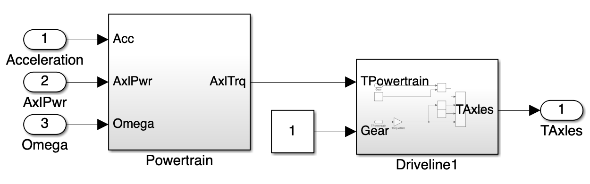
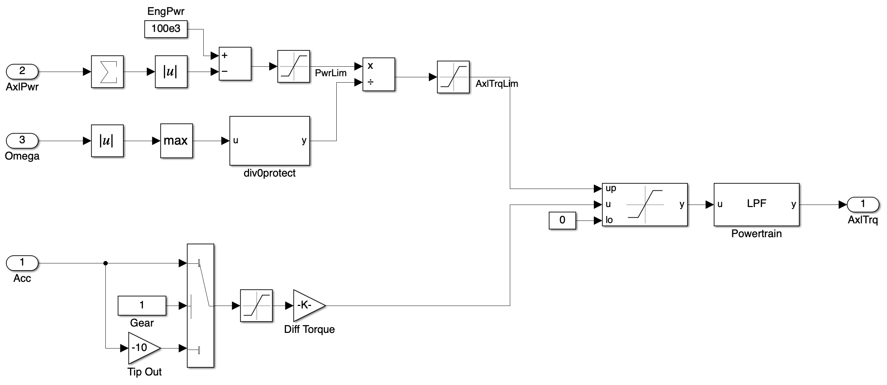
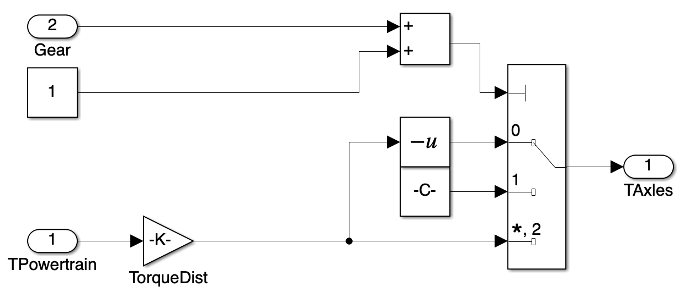

## Introduction and Objective {#introduction}

This document presents a basic truck dynamics model structure in Matlab Simulink, constructed by editing the existing Simulink model *6DOF truck-trailer dynamics* in the [Truck Platooning project](https://www.mathworks.com/help/driving/ug/truck-platooning-using-vehicle-to-vehicle-communication.html). The model includes components such as the accelerating/brake system, wheels and tires system, suspension system, and vehicle body system. The Simulink blocks are organized to represent the physical interactions between these components.

The purpose of this model is to simulate the dynamic behavior of a truck under various driving conditions, including acceleration, braking, and steering. The model can be used for testing control algorithms, analyzing vehicle performance, and evaluating different control algorithms such as PID controller and MPC controller. The modular design of the model allows for easy integration of additional features or subsystems in the future, such as advanced driver assistance systems (ADAS) or vehicle-to-vehicle communication.

## Model Assumption and Overall Structure {#overall-model-structure}

The truck dynamic model takes the desired *acceleration* and *steering angle* as inputs. By simulating the truck's response, the model outputs the truck's position, velocity and angular motion in both its inertial frame and global frame, as well as the forces and moments acting on the suspension and wheels. The output signals are packed into a bus for further processing and vehicle-to-vehicle communication. The model is structured to allow for modularity, enabling the addition of more complex components or subsystems in the future.

The dynamics of a real truck or most other ground vehicles contains three essential components, the **vehicle body**, the **suspension system**, and the **wheels and tires**. The vehicle body represents the main structure of the truck, while the suspension system models the interaction between the vehicle body and the wheels, including the forces and moments transmitted through the suspension components. The wheels and tires subsystem simulates the contact between the tires and the road surface, including tire forces and slip characteristics. The vehicle is driven by processing the control inputs through the **accelerating and brake system**. The interactions between these components are crucial for accurately simulating the truck's dynamics and response to control inputs.

## Model components {#model-components}

### Accelerating and brake system {#accelerating-and-brake-system}

#### Accelerating System {#accelerating-system}

{width=50%}

The accelerating system consists of a powertrain subsystem and a driveline subsystem. The powertrain subsystem simulates the accelerating behavior with consideration of realistic limit and output the requested total axle torque to the driveline subsystem. The driveline subsystem, choosing from Front Wheel Drive (FWD), Rear Wheel Drive (RWD), or All Wheel Drive (AWD) configurations, models the transfer of power from the engine to the wheels.

##### Powertrain Subsystem {#powertrain-subsystem}

{width=100%}

The powertrain subsystem takes in the desired acceleration input, current axle power consumption and wheel angular velocity, and calculates the required total axle torque. Currently, with only one forward gear option, the powertrain subsystem is modeled as a simple proportional controller that calculates the required axle torque based on the desired acceleration and current wheel angular velocity, with consideration of the engine power limit and the axle torque limit. In the future, the proportional gain can be tuned to achieve the desired response by integrating more complex powertrain models, such as those that consider engine dynamics, transmission characteristics, and wheel rotational kinematics. 

##### Driveline Subsystem {#driveline-subsystem}

{width=50%}

The driveline subsystem models the power transfer from the engine to the wheels. Depending on the chosen configuration (FWD, RWD, AWD), torque distribution is managed accordingly. Based on the gear (currently only one forward gear and one backward gear), the driveline subsystem manage the sign of the torque at each driven axle. The driveline subsystem outputs the torque applied to each driven wheel, which is then used by the wheels and tires system to calculate the forces generated by the tires.

#### Brake System {#brake-system}

The current brake system is a simple hydraulic system with fixed braking pressure, 200 kPa at front wheels and 1 MPa at rear wheels. When a negative acceleration is input, the brake system is activated and applies the corresponding braking forces to the wheels. In the future, the brake system can be improved by including the brake dynamics, wheel slip control, differential braking (DB), and anti-lock braking system (ABS) features.

### Wheels and Tires System {#wheels-and-tires-system}
The wheels and tires system simulates the interaction between the tires and the road surface. It includes components such as the tire model, which calculates the forces and moments generated by the tires based on slip and road conditions. The wheel dynamics block models the rotational motion of the wheels, while the tire-road interaction block simulates the contact patch and friction characteristics.

### Suspension System {#suspension-system}
The suspension system models the connection between the vehicle body and the wheels. It includes components such as the spring and damper blocks, which simulate the vertical motion of the suspension. The suspension geometry block models the kinematic relationships between the suspension components, while the suspension forces block calculates the forces transmitted through the suspension based on the vehicle's motion and road conditions.

### Vehicle Body {#vehicle-body}

The vehicle body model simulates the main structure of the truck, including its mass, inertia, and aerodynamic properties. It includes blocks for calculating the vehicle's position, velocity, and angular motion in both the inertial frame and global frame. The body dynamics block models the translational and rotational motion of the vehicle, while the aerodynamic forces block simulates the effects of air resistance on the truck's motion.

## Scalability and Modularity {#scalability-and-modularity}

The model is designed with scalability and modularity in mind, allowing for the addition of more complex components or subsystems in the future. For example, additional features such as advanced driver assistance systems (ADAS), vehicle-to-vehicle communication, or more detailed tire models can be integrated into the existing structure without significant modifications to the core components. This modular approach facilitates the development and testing of new features while maintaining the integrity of the overall model.

## Conclusion {#conclusion}

In conclusion, the truck model provides a comprehensive framework for simulating the dynamic behavior of a truck under various driving conditions. Its modular design allows for easy integration of new features and subsystems, making it a valuable tool for testing and evaluating advanced control algorithms and vehicle performance.